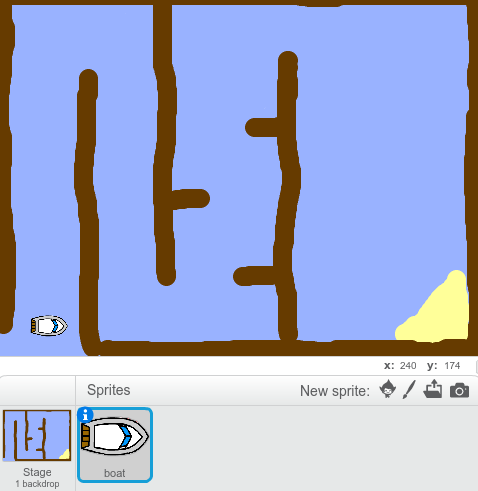

## Getting started

--- task ---
Open the starter project.

Download the offline starter project from [rpf.io/p/en/boat-race-scratch2-go](http://rpf.io/p/en/boat-race-scratch2-go){:target="_blank"}, and then open it using the offline editor.

If you need to download and install the Scratch offline editor, you can find it at [rpf.io/scratchoff](http://rpf.io/scratchoff).
--- /task ---

--- task ---

The project includes a boat sprite, and a race course backdrop with:

- Wood that the boat sprite has to avoid
- A desert island that the boat has to reach

  

--- /task ---
