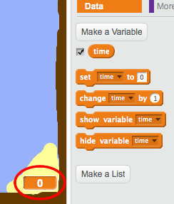
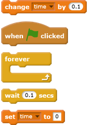
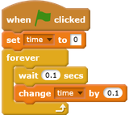

## Adding a timer

Now you will add a timer to your game, so that the player has to get to the island as quickly as possible.

--- task ---

Add a new variable called `time`{:class="blockdata"} to your Stage.

 

[[[generic-scratch-add-variable]]]

You can also choose a look for your timer by changing how your new variable is displayed.

--- /task ---

--- task ---

Now add code blocks to your Stage so that the timer counts up until the boat reaches the island.

--- hints ---
--- hint ---
On the Stage, `when the green flag is clicked`{:class="blockcontrol"}, `set the time to 0`{:class="blockdata"}. Inside your `forever`{:class="blockcontrol"} loop, you'll need to first `wait 0.1 secs`{:class="blockcontrol"}, then `change the time by 0.1`{:class="blockdata"}.
--- /hint ---
--- hint ---
Here are the code blocks you'll need:

--- /hint ---
--- hint ---
Here's what your new code should look like:

--- /hint ---
--- /hints ---

--- /task ---

--- task ---

Test out your game and see how quickly you can get the boat to the island!

 

--- /task ---
