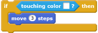
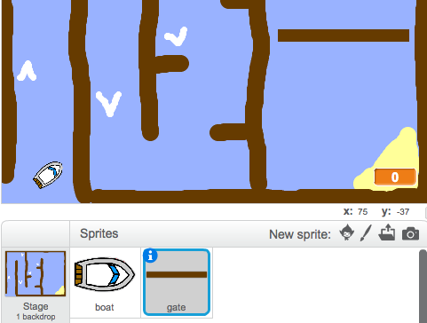
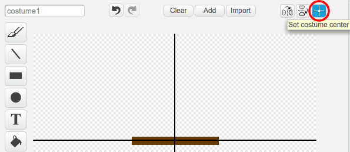
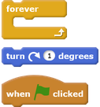
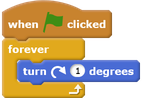

## Obstacles and boosters

Right now the game is **far** too easy, so you will add some things to make it more interesting.

First, you'll add some boosters to speed up the boat.

--- task ---

Edit your Stage backdrop by adding in some white booster arrows.

 

--- /task ---

--- task ---

Now add more code blocks to your boat's `forever`{:class="blockcontrol"} loop so that the boat sprite moves three extra steps when it touches a white arrow.

--- /task ---

--- task ---

Test your game to see whether your new booster arrows speed up the boat.

--- /task ---

Next you'll add a spinning gate that the boat has to avoid.

--- task ---

Add a new sprite that looks like this, and call it 'gate':

 

Make sure that the colour of the gate sprite is the same as the colour of the wooden barriers.

--- /task ---

--- task ---

Set the center of the gate sprite.

 

--- /task ---

--- task ---

Add code to your gate sprite to make it spin slowly forever.

--- hints ---
--- hint ---
Add code blocks to the gate sprite so that it `turns 1 degree`{:class="blockmotion"} `forever`{:class="blockcontrol"}.
--- /hint ---
--- hint ---
Here are the code blocks you need:

--- /hint ---
--- hint ---
Here's what your new code should look like:

--- /hint ---
--- /hints ---

--- /task ---

--- task ---

Test your game again. You should now have a spinning gate that you need to stir your boat around.

 

--- /task ---

