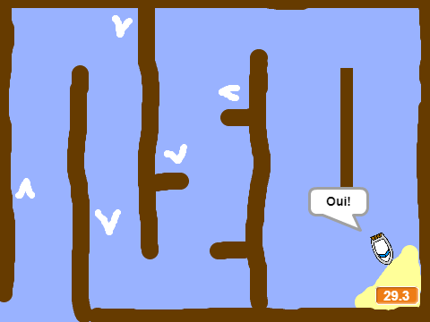

--- no-print ---

This is the **Scratch 2** version of the project. There is also a [Scratch 3 version of the project](https://projects.raspberrypi.org/fr-FR/projects/boat-race).

--- /no-print ---

## Introduction

Vous allez apprendre à faire un jeu dans lequel vous utiliserez la souris pour faire naviguer un bateau vers une île déserte.

  <iframe allowtransparency="true" width="485" height="402" src="https://scratch.mit.edu/projects/embed/63957956/?autostart=false" frameborder="0"></iframe>
  

